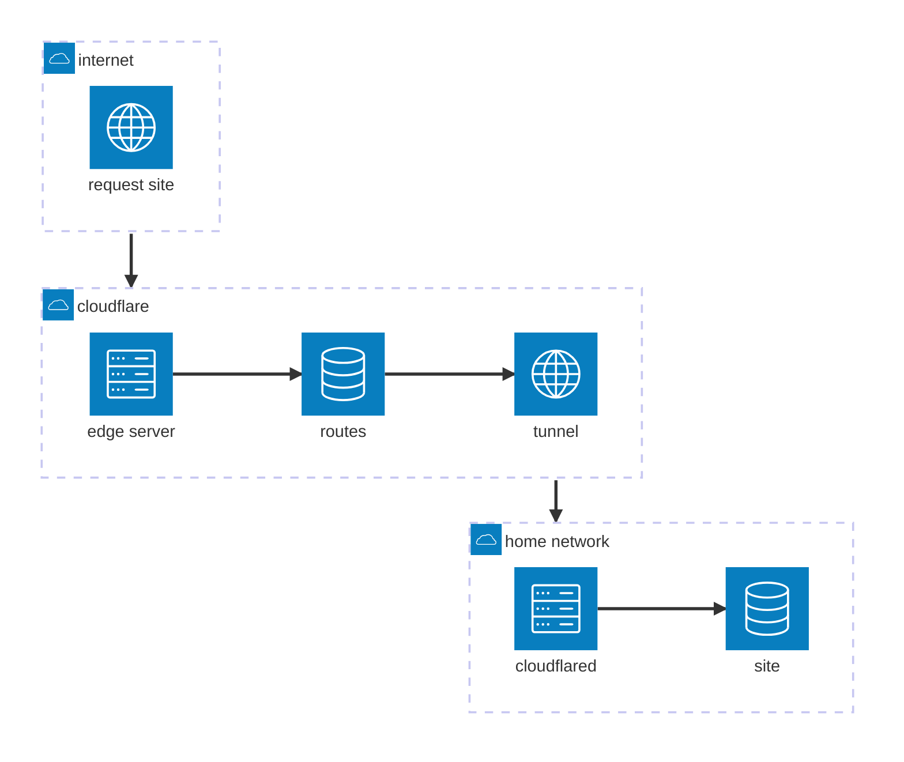

[TOC]

So you find yourself recreating your website using [Zola](https://www.getzola.org), and while doing so you evaluate your current hosting setup.
After reflection, having everything on a single server sounds like a bad idea -- especially with the potential for a future [copy.fail](https://access.redhat.com/security/cve/cve-2026-31431) existing and supply chain attacks.
Since I have a fancy [UX7](https://techspecs.ui.com/unifi/cloud-gateways/ux7) and a spare [Pi 4B](https://www.raspberrypi.com/products/raspberry-pi-4-model-b/) laying around, I might as well host on the pi.
Putting it behind an isolated vlan (DMZ[^1]) should be a good start.
But, even that would expose my home IP address to the tech savvy -- not that I care much about it, but it sounds like a fun exercise to avoid leaking my IP.
Luckily, [Cloudflare](https://developers.cloudflare.com/tunnel/) has got me covered with their free tier and their tunnel using `cloudflared`.

This note is mostly a writeup of all the things I did to get my site up and running.

## pi setup

I get myself a fresh copy of the [pi imager](https://www.raspberrypi.com/documentation/computers/getting-started.html#imager-install) and flash the latest version of their OS onto an SD card that was still present in the dormant pi.
Click a couple of buttons, type an SSID and password, and my UX7 shows a new device.
Note here that the imager downloads the OS for you -- downloading manually and selecting a custom image doesn't allow for configuration.

As with all new Linux servers, the first thing to do is to update and upgrade.
For a pi running a Debian-based OS, this means running `sudo apt update && sudo apt upgrade`.
Now that I have an up-to-date system, the configuration fun can begin.
First up: secure and paswordless ssh access to the system.
This is not just a good idea in general, but a soft requirement for future CI/CD automation.

### secure ssh

Joe Testa has a nice little script called [ssh-audit](https://github.com/jtesta/ssh-audit) that checks any ip for its ssh config; install with `sudo apt install ssh-audit` and run `ssh-audit localhost` to check the pi's ssh config for security issues.
It produces quite some output, some of it red to indicate something bad.

```text
# key exchange algorithms
(kex) ecdh-sha2-nistp256                  -- [fail] using elliptic curves that are suspected as being backdoored by the U.S. National Security Agency
                                          `- [info] available since OpenSSH 5.7, Dropbear SSH 2013.62
(kex) ecdh-sha2-nistp384                  -- [fail] using elliptic curves that are suspected as being backdoored by the U.S. National Security Agency
                                          `- [info] available since OpenSSH 5.7, Dropbear SSH 2013.62
(kex) ecdh-sha2-nistp521                  -- [fail] using elliptic curves that are suspected as being backdoored by the U.S. National Security Agency
                                          `- [info] available since OpenSSH 5.7, Dropbear SSH 2013.62
```

Seems reasonable to disable these.
I don't particularly care about having _these_ algo's now, do I?
There's more red (and orange!) in the output, but it's all similar: either the NSA uses the back, or algorithms are old/weak and not up-to-date with what `ssh-audit` considers good.
How fix?
By creating a file under `/etc/ssh/sshd_config.d/` and disabling those algo's.
I've called mine `50-restrict-key-exchange-algorithms.conf` [^2], since what we're doing in it is precisely restricting key exchange algorithms.

```ssh-config
### 2026-05-04
### Disable weaker key exchange algorithms

KexAlgorithms sntrup761x25519-sha512@openssh.com,curve25519-sha256,curve25519-sha256@libssh.org,diffie-hellman-group18-sha512,diffie-hellman-group-exchange-sha256,diffie-hellman-group16-sha512
Ciphers chacha20-poly1305@openssh.com,aes256-gcm@openssh.com,aes256-ctr,aes192-ctr,aes128-gcm@openssh.com,aes128-ctr
MACs hmac-sha2-512-etm@openssh.com,hmac-sha2-256-etm@openssh.com,umac-128-etm@openssh.com
RequiredRSASize 3072
HostKeyAlgorithms sk-ssh-ed25519-cert-v01@openssh.com,ssh-ed25519-cert-v01@openssh.com,rsa-sha2-512-cert-v01@openssh.com,rsa-sha2-256-cert-v01@openssh.com,sk-ssh-ed25519@openssh.com,ssh-ed25519,rsa-sha2-512,rsa-sha2-256
CASignatureAlgorithms sk-ssh-ed25519@openssh.com,ssh-ed25519,rsa-sha2-512,rsa-sha2-256
HostbasedAcceptedAlgorithms sk-ssh-ed25519-cert-v01@openssh.com,ssh-ed25519-cert-v01@openssh.com,rsa-sha2-512-cert-v01@openssh.com,rsa-sha2-256-cert-v01@openssh.com,sk-ssh-ed25519@openssh.com,ssh-ed25519,rsa-sha2-512,rsa-sha2-256
PubkeyAcceptedAlgorithms sk-ssh-ed25519-cert-v01@openssh.com,ssh-ed25519-cert-v01@openssh.com,rsa-sha2-512-cert-v01@openssh.com,rsa-sha2-256-cert-v01@openssh.com,sk-ssh-ed25519@openssh.com,ssh-ed25519,rsa-sha2-512,rsa-sha2-256
```

> Don't know what these things do?
> [Read the docs](https://manpages.debian.org/trixie/openssh-server/sshd_config.5.en.html)!
>
> | Directive                     | Description                                                                                                                   |
> | ----------------------------- | ----------------------------------------------------------------------------------------------------------------------------- |
> | `KexAlgorithms`               | Specifies the permitted KEX (Key Exchange) algorithms that the server will offer to clients.                                  |
> | `Ciphers`                     | Specifies the ciphers allowed.                                                                                                |
> | `MACs`                        | Specifies the available MAC (message authentication code) algorithms.                                                         |
> | `RequiredRSASize`             | Specifies the minimum RSA key size (in bits) that sshd(8) will accept.                                                        |
> | `HostKeyAlgorithms`           | Specifies the host key algorithms that the server offers.                                                                     |
> | `CASignatureAlgorithms`       | Specifies which algorithms are allowed for signing of certificates by certificate authorities (CAs).                          |
> | `HostbasedAcceptedAlgorithms` | Specifies the signature algorithms that will be accepted for hostbased authentication as a list of comma-separated patterns.  |
> | `PubkeyAcceptedAlgorithms`    | Specifies the signature algorithms that will be accepted for public key authentication as a list of comma-separated patterns. |
> | `PasswordAuthentication`      | Specifies whether password authentication is allowed.                                                                         |
> | `AuthenticationMethods`       | Specifies the authentication methods that must be successfully completed for a user to be granted access.                     |
> | `AuthorizedKeysFile`          | Specifies the file that contains the public keys used for user authentication.                                                |
> | `AllowGroups`                 | This keyword can be followed by a list of group name patterns, separated by spaces.                                           |

There's one more thing to do, this one less straightforward, and it's got to do with how exchange algorithms work.
Generally speaking, exchange algorithms work by using some prime $p$ as modulus.
In e.g. `diffie-hellman` (which the keen eyed has seen in the config above), being secure is done by having sufficiently large $p$, such that computing discrete logarithms modulo $p$ is hard[^3].
So, the smaller $p$, the easier it is to accidentally guess private information you're not supposed to know.
These values of $p$, for a variety of algo's, are stored in `/etc/ssh/moduli`.
Below three-liner modifies it so that only primes of bit size larger than 3071 are used, which is equal to the minimum size set in the config file above.

```bash
cp /etc/ssh/moduli /etc/ssh/moduli.bak
awk '$5 >= 3071' /etc/ssh/moduli > /etc/ssh/moduli.safe  
mv /etc/ssh/moduli.safe /etc/ssh/moduli
```

### passwordless ssh

The `ssh-audit` tool is happy now, but I'm not happy yet.
I don't necessarily enjoy the idea of password-based ssh access.
Let's disable it, and only allow key-based ssh, e.g. under `/etc/ssh/sshd_config.d/50-force-publickey-auth.conf`.

```ssh-config
### 2026-05-04
### Disabled password SSH; force key-based authentication

PasswordAuthentication no
AuthenticationMethods publickey
AuthorizedKeysFile .ssh/authorized_keys
```

> [!CAUTION]
> Make sure to create the `.ssh/authorized_keys` file in your home directory, and add your public key(s) to it!
> It should also be `chmod 600` for correct permissions, or ssh gets upset and will complain at you.

After setting up above config file, and making sure keys are in place, let's make sure that only users in an `ssh` group can ssh into the pi.
First create the group using `sudo groupadd ssh`, then add the user to it with `sudo usermod -aG ssh $USER` (assuming you're running as the user who should have ssh access).
Finally, tell `sshd` that only users in the just created `ssh` group are allowed to log in, e.g. under `/etc/ssh/sshd_config.d/50-allow-groups.conf`.

```ssh-config
### 2026-05-04
### Only allow users in the ssh group to log in 

AllowGroups ssh
```

### disable wifi

Having setup SSH properly, next up on the agenda is to disable the pi's wifi.
This will be important later when I move the pi into a dedicated VLAN.
Luckily, this is pretty easy to do with `nmcli`, which is installed by default on the pi's OS.
First, run `nmcli -t -f TYPE,UUID,NAME con` to get a list of all network connections.
Find the one that corresponds to the wifi connection, e.g. `wlan0`, and copy its UUID.
Then, use `sudo nmcli c delete <UUID>` to delete the wifi connection.
This makes it so that the pi won't have the wifi creds anymore, and thus cannot connect to the network[^4].

## vlan setup

Having set up the pi for proper ssh access, it's time to move it into an isolated network.
My UX7 is running `Network 10.3.58` at time of writing, on top of Unify OS `5.0.16`.
It's got `192.168.1.1` as its ip, which is the default.

On the [settings overview](https://192.168.1.1/network/default/settings/settings_overview) page, I can create a new network by clicking **Create New** under **Networks**.
Give it a name, e.g. `public`, and set its zone to `DMZ`.
Also make sure that the VLAN ID makes sense, e.g. `2` for `192.168.2.x`.
For now, leave everything on default.
We'll modify this later to be an isolated, but first I want to make sure the pi gets a static ip across reboots.

Find what port the pi is connected to, either by looking at the [topology](https://192.168.1.1/network/default/topology), looking through the [clients overview](https://192.168.1.1/network/default/clients/main), or by looking at [all the ports](https://192.168.1.1/network/default/ports) in your network.
Using the ports page is probably easiest, since that's where we'll modify the settings.
Select the port the device is connected to -- for me this is `Port 2` on a switch named `Switch@Server`.
On the right side, modify **Core Settings** to use the freshly made `public` network, making sure that _Tagged VLAN Management_ is set to "Allow All"; this makes sure that any switches higher in the hierarchy can actually route the selected vlan to this port.
At this point, reboot the pi so that  can get a new ip address (and so no lingering config is used from the previous network and/or disabled wifi connection).
After a while the pi should show up in the clients overview, and should have received an ip address in the `192.168.2.x` range.
Click on it, open settings, and under **IP Settings** tick the "Fixed IP ADdress" box.
If you don't like whichever address DHCP has given the pi, change it here.
Click **Apply Changes**, and the pi should now have a static ip address in the `public` network.

At this point, the pi is in the `public` network and has a static ip address; it's also in the DMZ zone of the router.
But, it's not yet fully isolated.
Any device from the `home` network can still poke it.
In preparation of ticking that elusive "Isolate Network" box some firewall shenanigans have to take place.
Losing access to the pi would be mildly annoying, especially for those without a _micro HDMI_ cable lying around.
Really, who thought that this was a good idea?
Anyway, add a firewall rule from whichever device(s) you use to manage your network/server(s)/pi and allow access to the pi's ip address on port 22 (ssh).
This is done on the [policy table](https://192.168.1.1/network/default/settings/policy-table) page.
Click the big "Create New Policy" button in the top left.
Then, on the right, give it a name, e.g. `allow ssh to pi`, and set the source to be either a specific device, or the whole `home` network (though if it's the entire network, why use isolation at all?).
For me, the devices are my phone, laptop, and my other server itself.
The _source_ port can be left as any, since I don't particularly care which port the ssh connection is coming from.
Of course, the action should be **Allow**.
At the destination zone, select the `DMZ` zone, since that's where the pi is.
You can do the entire zone, a specific network, or even a specific IP.
I've set it up to allow the entire `public` network in case I add more devices to it in the future.
Make sure to set the _destination_ port to ssh.
At this point, notice how under "Action", the return traffic box is automatically ticked.
This is good, since otherwise it means that the pi can't send any traffic back to the device that initiated the ssh connection, which would break the connection.
All other settings are at this point not super relevantl; click **Add Policy** to add the policy after adding an optional description at the bottom.

For convenience, it might make sense to also allow for `http` (80) and `https` (443) -- I suggest creating 2 separate policies for this, so everything stays nicely modular [^5].
Now that these policies are in place, isolation of the `public` network has green light.
This is done in the same place as the network was created; switch to manual, then tick the box.
Under the zone based firewall view it should look something like this.

{{ img(path="/img/ux7-firewall.jpg", op="fit_width", width=1000, height=3000, caption="Zone based firewall view, when selecting DMZ -> Internal.") }}

Nice!
The allow rules are in place, above the network isolation rule, so the pi is still accessible from the devices specified, but any other device from the `home` network won't be able to poke it.

## webserver setup

With the pi in an isolated network with a proper firewall setup it's finally time to actually do something with it.
Like hosting a site.
The one you're reading.
So, get some form of webserver, and it's showtime.
My main server runs `nginx` which I'm already rather familiar with, so I figured I'd try out [`caddy`](https://caddyserver.com/docs/install) this time.
Supposedly it's a lot easier to use, and has automatic Let's Encrypt certificates, which is a nice bonus.
Installation is as easy as adding their repository and installing the package -- below lines are taken straight from the linked docs.

```bash
sudo apt install -y debian-keyring debian-archive-keyring apt-transport-https curl
curl -1sLf 'https://dl.cloudsmith.io/public/caddy/stable/gpg.key' | sudo gpg --dearmor -o /usr/share/keyrings/caddy-stable-archive-keyring.gpg
curl -1sLf 'https://dl.cloudsmith.io/public/caddy/stable/debian.deb.txt' | sudo tee /etc/apt/sources.list.d/caddy-stable.list
sudo chmod o+r /usr/share/keyrings/caddy-stable-archive-keyring.gpg
sudo chmod o+r /etc/apt/sources.list.d/caddy-stable.list
sudo apt update
sudo apt install caddy
```

Installation is succesful if you see `systemctl status caddy` show that it's active and running.
It's also possible to go to `http://<pi-ip-address>` and see the default caddy page[^6], which means that the webserver is working.
For my actual site, I've pointed caddy to `/var/www/dbarenholz.com` (ownership `dan:dan`, permissions `755`), where I've put the generated static files from Zola.
Then, in my home dir I can use `ln -s /var/www/dbarenholz.com site` to create a symlink that I'm allowed to edit (and thus automations are allowed to write to).

## cloudflare tunnel

Now for la piece de resistance: the cloudflare tunnel.
I've attempted to create a diagram to explain how this works.
Mermaid isn't really the best tool, but it should get the point across.



The flow with a cloudflare tunnel is as follows:

1. Someone visits the site, e.g. `dbarenholz.com`.
2. Because cloudflare is managing the domain DNS-wise, the request goes to cloudflare's edge servers.
3. The servers check routing rules, and see that the request should be routed to the tunnel.
4. The tunnel talks to `cloudflared` running on the pi to receive the connection.
5. The request is forwarded to `127.0.0.1:80`: the caddy webserver, which serves the site.

The reason this works is because I set up a tunnel in the first place.
This is extremely straightforward to do by following the docs.
Roughly speaking:

1. Get DNS onto a free cloudflare account and fix nameservers at registrar to point to cloudflare.
2. `ctrl+k`, type `Tunnel`, open the tunnel page, and make a new tunnel. Give it a descriptive name while you're at it.
3. Follow the steps under "Setup Environment" -- for me this is clicking debian 64 bit.
4. Mission success! Tunnel has been made; now run this magical command to ensure DNS is setup properly: `cloudflared tunnel route dns <tunnel-name> <domain>`.

> [!CAUTION]
> If `tunnel route dns` errors out, it's probably because in step 1 you also copied A/AAAA/CNAME records and are trying to add a duplicate record.
> Remove the A/AAAA/CNAME records that point to the public IP address.
> Then, run the command again, and it should work.

For convenience, also use the **Bulk Redirects** feature to add a redirect from `www.domain` to `domain`, so that both work.
This is very straightforward to do.
Use `ctrl+k` to search for the page, open it, and click a couple of buttons.

## conclusion

And everything is setup.
To recap, here's what I did:

1. Set up the pi with a secure ssh config, and disabled wifi.
2. Create a new network on the UX7, and moved the pi into it.
3. Set up firewall rules to allow access to the pi that's on an otherwise isolated network.
4. Set up a webserver on the pi.
5. Set up a cloudflare tunnel to avoid leaking my home IP address.

This is everything I need.
Looking forward to a reason why this isn't sufficient, and switching everything up again!

[^1]: I don't like the term DMZ; I don't run a "demilitarized zone", I run a network that sits between the big scary Internet and my own home network, whose purpose is to expose stuff to the world, without comprimising the security of the rest of my network.
[^2]: Curious why certain keywords aren't highlighted? [See this issue](https://github.com/textmate/ssh-config.tmbundle/issues/7).
[^3]: If you're curious, look at [the Diffie-Hellman problem](https://en.wikipedia.org/wiki/Diffie%E2%80%93Hellman_problem) -- fair warning, this includes some math.
[^4]: There are other ways to do this with `rfkill` or with a file in `/etc/network/interfaces.d/`, but this works and is rather straightforward to do.
[^5]: You can use a single rule too, whichever floats your boat. I prefer being explicit.
[^6]: The default caddy page is miles more fun than the default nginx page. It's slanted!
